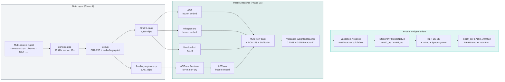

<div align="center">


<br>

<a href="https://git.io/typing-svg">
  
</a>

<br>
<br>

<picture>
  <source media="(prefers-color-scheme: dark)" srcset="https://img.shields.io/badge/Phase_3-Shipped-0F766E?style=for-the-badge&labelColor=0F172A">
  
</picture>
&nbsp;

&nbsp;

&nbsp;


<br><br>


&nbsp;

&nbsp;

&nbsp;

&nbsp;

&nbsp;


<br><br>

**A three-phase research project that takes infant-cry classification from a leaky 0.270 macro-F1 baseline,**
**through a 0.507 hybrid ensemble, to a final EfficientAT `mn10_as` edge student at 0.7159 ± 0.0403 macro-F1,**
**retaining 99.9% of its multi-teacher ensemble while running as an 8.62 MB INT8 audio CNN.**

<br>

<a href="reports/phase3_report/phase3_report.pdf"></a>
&nbsp;
<a href="reports/phase3_presentation/presentation.html"></a>
&nbsp;
<a href="notebooks/Phase2A_Pretrained_Feature_Bank.ipynb"></a>

</div>


<br>

##  &nbsp; The headline

<div align="center">

<table>
<tr>
<th align="center" width="25%">Phase 1<br><sub>Classical baseline</sub></th>
<th align="center" width="25%">Phase 2<br><sub>Hybrid ensemble</sub></th>
<th align="center" width="25%">Phase 3 — Teacher<br><sub>Validation-weighted multi-view</sub></th>
<th align="center" width="25%">Phase 3 — Student<br><sub>EfficientAT mn10_as</sub></th>
</tr>
<tr>
<td align="center"><h2>0.270</h2><sub>SVM + SMOTE</sub></td>
<td align="center"><h2>0.507</h2><sub>SVM + CNN-BiLSTM fusion</sub></td>
<td align="center"><h2>0.7168</h2><sub>± 0.0185&nbsp;&middot;&nbsp;distillation teacher</sub></td>
<td align="center"><h2>0.7159</h2><sub>99.9% retention&nbsp;&middot;&nbsp;8.62 MB INT8</sub></td>
</tr>
</table>

</div>

> **+165%** macro-F1 over Phase 1 &nbsp;·&nbsp; **+41%** over Phase 2 &nbsp;·&nbsp; the final edge student essentially matched the teacher while running as one compact audio CNN.

<br>


<br>

##  &nbsp; The journey

The project ran through three phases. Each one solved the failure mode of the previous one.

<br>

<div align="center">

| Phase | Approach | Key technique | Macro-F1 | Footprint |
|:-----:|:---------|:--------------|:--------:|:---------:|
| **1** | Classical ML on Donate-a-Cry | 411-d MFCC/CQCC/F0/chroma + SVM + SMOTE + OvO | 0.270 | n/a |
| **2** | Hybrid CNN-BiLSTM + classical | Mel-spec + LDAM/DRW + weighted ensemble with Phase 1 SVM | 0.507 | 35.9 KB INT8 |
| **3** | Pretrained foundations + distillation | AST + Whisper + handcrafted → validation-weighted teacher → EfficientAT MobileNet student | **0.7159 ± 0.0403** | **1.65–8.62 MB INT8** |

</div>

<br>

> **Why Phase 3 broke the ceiling.** Phase 2 had already shown that bespoke deep models over-fit on a tiny cry corpus. Phase 3 stops fighting from scratch and instead borrows representational power from large pretrained audio foundations (AST, Whisper), builds a validation-weighted multi-teacher ensemble, and only *then* distils that knowledge into a tiny MobileNetV3 audio student so the system can run on edge hardware.

<br>


<br>

##  &nbsp; Architecture



<br>


<br>

##  &nbsp; Data layer

Phase 1 and 2 used Donate-a-Cry only. Phase 3 ingests every public cry source we could find and gates ruthlessly.

<br>

<div align="center">

| Manifest | Purpose | Clips | Notes |
|:---------|:--------|:-----:|:------|
| `cause5_authentic_strict_v2` | 5-class supervised training/eval | **1,355** | hunger, discomfort, tiredness, belly_pain, burping |
| `auxiliary_cry_nocry_v2` | Cry/non-cry representation learning **only** | **1,781** | never seen by the 5-class trainer |

<br>

| Class | Strict count | Note |
|:------|:------------:|:-----|
| Hunger | ~525 | dominant |
| Discomfort | ~295 | |
| Tiredness | ~155 | |
| Belly pain | **34** | ultra-rare |
| Burping | **26** | ultra-rare |

</div>

<br>

> **Honest caveat.** belly\_pain (n=34) and burping (n=26) remain the macro-F1 ceiling on this corpus. With those two removed, every Phase 3 feature bank crosses **0.70+** macro-F1 — the gap is a data problem, not a representation problem.

<br>


<br>

##  &nbsp; Method

### `5.1` &nbsp; Auxiliary AST cry/non-cry adaptation

Start from MIT/IBM's AudioSet-pretrained **AST** (86M params). Fine-tune it as a binary cry/non-cry classifier on the 1,781-clip auxiliary manifest with class-balanced cross-entropy + AdamW + cosine schedule. Converges in **3 epochs** to macro-F1 > **0.96**. The adapted encoder becomes the `ast_aux_adapted` feature bank — without ever touching a 5-class label.

### `5.2` &nbsp; Multi-view feature bank

Eight feature banks built from four base views:

<div align="center">

| Bank | AST | AST-aux | Whisper | Handcrafted |
|:-----|:---:|:-------:|:-------:|:-----------:|
| `handcrafted` | | | | ✓ |
| `whisper` | | | ✓ | |
| `ast` | ✓ | | | |
| `ast_aux_adapted` | | ✓ | | |
| `no_aux_no_whisper` | ✓ | | | ✓ |
| `aux_no_whisper` | | ✓ | | ✓ |
| `no_aux_with_whisper` | ✓ | | ✓ | ✓ |
| **`aux_with_whisper`** ⭐ | | ✓ | ✓ | ✓ |

</div>

All views are concatenated, projected through PCA-128 + StandardScaler, and classified with five heads: **RBF SVM**, calibrated linear SVM, balanced LogReg, balanced RF, prototype, plus a soft-voting ensemble.

### `5.3` &nbsp; Edge distillation onto EfficientAT

The deployable model is a real audio CNN, not an image model: **EfficientAT MobileNetV3** ([fschmid56/EfficientAT](https://github.com/fschmid56/EfficientAT)) — AudioSet-pretrained, distilled from PaSST transformers, AudioSet's `baby_cry` class baked in.

For each seed we (a) fit RBF SVM and balanced LogReg on every feature bank, (b) keep the top-N validation candidates, (c) Dirichlet-search weights to maximise validation macro-F1, then use the resulting probability matrix as soft labels. The student trains on:

```
ℒ = α · T² · KL(p_T^S ‖ p_T^T)  +  (1 − α) · CE_LS(p^S, y)
α = 0.7   ·   T = 4.0   ·   label-smoothing 0.05
```

with 16 kHz → 32 kHz on-the-fly resampling, **EfficientAT's `AugmentMelSTFT` + SpecAugment**, **mixup α=0.2**, **class-balanced sampler**, AdamW with separate backbone/head LR groups, cosine schedule, and **per-seed resumable checkpoints** so a Colab disconnect doesn't waste work.

<br>


<br>

##  &nbsp; Results

### `6.1` &nbsp; Teacher — 5-seed repeated stratified evaluation

<div align="center">

| Feature bank | Mean macro-F1 | Std | Min | Max |
|:-------------|:-------------:|:---:|:---:|:---:|
| **AST-aux + Whisper + handcrafted** ⭐ | **0.6566** | 0.048 | 0.6201 | 0.7486 |
| AST (frozen) | 0.6415 | 0.063 | 0.5683 | 0.7319 |
| AST + handcrafted | 0.6390 | 0.097 | 0.4833 | 0.7836 |
| AST + Whisper + handcrafted | 0.6351 | 0.083 | 0.5239 | 0.7554 |
| AST-aux + handcrafted | 0.6310 | 0.100 | 0.4771 | 0.7811 |
| AST-aux | 0.6299 | 0.063 | 0.5671 | 0.7286 |
| Handcrafted (411-d) | 0.6231 | 0.071 | 0.5465 | 0.7505 |
| Whisper encoder | 0.5653 | 0.078 | 0.4840 | 0.6953 |

</div>

<br>

### `6.2` &nbsp; Phase progression on the strict 5-class manifest

<div align="center">

| Approach | Accuracy | Macro-F1 | Weighted-F1 | Setup |
|:---------|:--------:|:--------:|:-----------:|:------|
| Phase 1 — SVM + SMOTE | 0.815 | 0.270 | 0.783 | 411-d handcrafted |
| Phase 2 — Hybrid weighted | 0.926 | 0.507 | 0.905 | CNN-BiLSTM + SVM ensemble |
| **Phase 3 — Teacher (5-seed mean)** | — | **0.6566 ± 0.048** | — | AST-aux + Whisper + hc → RBF SVM |
| **Phase 3 — Teacher (best fold)** | — | **0.7486** | — | same, best of 5 seeds |

</div>

<br>

### `6.3` &nbsp; Edge student — actual distilled results

<div align="center">

| Model | Macro-F1 | Retention vs teacher | Params | INT8 size | CPU INT8 latency |
|:------|:--------:|:--------------------:|:------:|:---------:|:---------------:|
| Multi-teacher ensemble | 0.7168 ± 0.0185 | 100.0% | heavy | — | — |
| **`mn10_as`** ⭐ | **0.7159 ± 0.0403** | **99.9%** | 4.21 M | 8.62 MB | 79.2 ms |
| `mn04_as` | 0.6500 ± 0.0390 | 90.7% | 0.72 M | 1.65 MB | 44.1 ms |

</div>

> **Final model choice:** `mn10_as`. It retains essentially all teacher performance while replacing the heavy AST + Whisper + SVM runtime with one compact AudioSet-pretrained audio CNN.

<br>


<br>

##  &nbsp; Deliverables

<div align="center">

| Artifact | Format | Path |
|:---------|:------:|:-----|
| 📄 IEEE-style Phase 3 report | PDF · 11 pages | [`reports/phase3_report/phase3_report.pdf`](reports/phase3_report/phase3_report.pdf) |
| 🎬 Phase 3 slide deck | HTML · 20 slides | [`reports/phase3_presentation/presentation.html`](reports/phase3_presentation/presentation.html) |
| ⚡ End-to-end Colab notebook | `.ipynb` | [`notebooks/Phase2A_Pretrained_Feature_Bank.ipynb`](notebooks/Phase2A_Pretrained_Feature_Bank.ipynb) |
| 📊 Repeated-eval summary | CSV | [`reports/phase3_report/figures/repeated_eval_summary.csv`](reports/phase3_report/figures/repeated_eval_summary.csv) |
| 🖼️ Publication figures | PNG ×10 | [`reports/phase3_report/figures/`](reports/phase3_report/figures) |
| 📑 Phase 2 report (legacy) | PDF | [`reports/phase2_report/phase2_report.pdf`](reports/phase2_report/phase2_report.pdf) |
| 📑 Phase 1 report (legacy) | PDF | [`reports/phase1_report/`](reports/phase1_report) |

</div>

<br>


<br>

##  &nbsp; Tech stack

<div align="center">


&nbsp;

&nbsp;

&nbsp;

<br><br>

&nbsp;

&nbsp;

&nbsp;

&nbsp;

<br><br>

&nbsp;

&nbsp;


</div>

<br>


<br>

<details>
<summary><h2> &nbsp; Project structure</h2></summary>
<br>

```
Infant-State-Recognition-System/
│
├─ notebooks/
│   ├─ Phase2A_Pretrained_Feature_Bank.ipynb     # one-shot Phase 3 Colab notebook
│   └─ Phase2B_Final_Mountain.ipynb              # Phase 2B (parked, code retained)
│
├─ src/
│   ├─ phase2a/
│   │   ├─ config.py             # paths, splits, model names
│   │   ├─ data.py               # manifest loaders, stratified splits
│   │   ├─ embeddings.py         # AST / Whisper / handcrafted extractors
│   │   ├─ classifiers.py        # RBF-SVM, LogReg, RF, prototype, prefit voting
│   │   └─ auxiliary.py          # AST aux cry/non-cry adaptation utils
│   └─ phase2b/                  # tuned-SVM, weighted ensemble, JEPA-lite (parked)
│
├─ scripts/
│   ├─ phase_a_ingest_external.py
│   ├─ phase_a_prepare_data.py
│   ├─ phase2a_auxiliary_adaptation.py
│   ├─ phase2a_feature_bank.py
│   ├─ phase2a_build_feature_sets.py
│   ├─ phase2a_train_classifiers.py
│   ├─ phase2a_repeated_evaluation.py
│   ├─ package_phase2a_colab.py
│   ├─ phase3_distill_edge_student.py     # multi-teacher KD onto EfficientAT
│   └─ phase3_make_figures.py             # publication figures
│
├─ reports/
│   ├─ phase1_report/                     # legacy
│   ├─ phase2_report/                     # legacy
│   ├─ presentation/                      # Phase 2 deck
│   ├─ phase3_report/
│   │   ├─ phase3_report.{tex,pdf}        # IEEE-style Phase 3 report
│   │   └─ figures/                       # 9 publication figures + repeated_eval_summary.csv
│   └─ phase3_presentation/
│       └─ presentation.html              # 20-slide story deck
│
├─ results/
│   ├─ phase1_corrected/                  # leak-free Phase 1
│   ├─ phase1_leaky/                      # quarantined for transparency
│   ├─ phase2/                            # Phase 2 metrics + plots
│   └─ phase2a/                           # populated by the Colab run (gitignored)
│
├─ requirements-phase2a.txt
└─ README.md
```

> The 914 MB `data_lake/` (raw + canonicalised audio, manifests, perceptual fingerprints) is git-ignored. The pipeline regenerates it from public sources.

</details>

<br>


<br>

##  &nbsp; Quickstart

### Run the full Phase 3 pipeline on Colab _(recommended — uses a free T4)_

1. Mount Drive and clone the repo into Drive.
2. Open [`notebooks/Phase2A_Pretrained_Feature_Bank.ipynb`](notebooks/Phase2A_Pretrained_Feature_Bank.ipynb) in Colab.
3. Run top-to-bottom. The notebook walks through:

   ```
   ▸ install deps                    ▸ build the multi-view feature bank
   ▸ verify manifests + splits        ▸ run 5-seed repeated evaluation
   ▸ AST aux cry/non-cry adaptation   ▸ Phase 3 edge distillation (mn10 + mn04)
   ▸ extract AST + Whisper features   ▸ generate publication figures
   ```

   Total wall-clock on a free T4: ~30 min for the teacher pipeline, ~35–60 min for both edge variants.

### Run components locally

```bash
git clone https://github.com/BelalRaza/Infant-State-Recognition-System.git
cd Infant-State-Recognition-System
python3.10 -m venv venv && source venv/bin/activate
pip install -r requirements-phase2a.txt

# 1. ingest, canonicalise, dedup the public cry sources
python scripts/phase_a_ingest_external.py
python scripts/phase_a_prepare_data.py

# 2. (optional) auxiliary AST cry/non-cry adaptation
python scripts/phase2a_auxiliary_adaptation.py

# 3. build feature banks + train classifiers
python scripts/phase2a_feature_bank.py
python scripts/phase2a_build_feature_sets.py
python scripts/phase2a_train_classifiers.py
python scripts/phase2a_repeated_evaluation.py

# 4. distil onto EfficientAT MobileNetV3
python scripts/phase3_distill_edge_student.py --variant mn10_as --n-seeds 5
python scripts/phase3_distill_edge_student.py --variant mn04_as --n-seeds 5

# 5. publication figures + report PDF
python scripts/phase3_make_figures.py --results-dir results/phase2a
cd reports/phase3_report && pdflatex phase3_report.tex && pdflatex phase3_report.tex
```

<br>


<br>

##  &nbsp; What was deliberately not done

This section is here on purpose — papers that hide their negative space are not trustworthy.

- **No end-to-end fine-tuning of AST on the 5-class task.** With n=34 and n=26 ultra-rare classes, full fine-tuning blows up the variance. We adapt AST only on the binary cry/non-cry auxiliary task.
- **No JEPA / self-supervised pretraining in the deliverables.** The Phase 2B AudioJEPA-lite + multi-view teacher work is parked under `src/phase2b/` and `scripts/phase2b_*.py` and not part of the Phase 3 submission.
- **No cross-site evaluation.** 5-seed mean ± std is over splits, not over independent recording sites — listed under future work.
- **No synthetic generative augmentation** of belly_pain or burping. Worth trying, deliberately out of scope.

<br>


<br>

##  &nbsp; References

1. Gong, Y., Chung, Y.-A., Glass, J. **AST: Audio Spectrogram Transformer.** _Interspeech 2021._
2. Radford, A. et al. **Robust Speech Recognition via Large-Scale Weak Supervision (Whisper).** _ICML 2023._
3. Schmid, F., Koutini, K., Widmer, G. **Efficient Large-Scale Audio Tagging via Transformer-to-CNN Knowledge Distillation (EfficientAT).** _ICASSP 2023._ &nbsp;[[code]](https://github.com/fschmid56/EfficientAT)
4. Hinton, G., Vinyals, O., Dean, J. **Distilling the Knowledge in a Neural Network.** _arXiv:1503.02531, 2015._
5. Cao, K. et al. **Learning Imbalanced Datasets with Label-Distribution-Aware Margin Loss (LDAM).** _NeurIPS 2019._
6. Ji, C. et al. **A review of infant cry analysis and classification.** _EURASIP J. Audio, Speech, Music Processing, 2021._
7. Dunstan, P. (2006). _Dunstan Baby Language_ — five universal cry categories.

<br>


<br>

<div align="center">

<sub><b>Authors</b></sub>
<br>
<sub>Meghavi Rao &nbsp;<code>230044</code> &nbsp;·&nbsp; Belal Raza &nbsp;<code>230094</code></sub>
<br>
<sub>6th Semester &nbsp;·&nbsp; Deep Learning &amp; Advanced Machine Learning &nbsp;·&nbsp; Project 3 &nbsp;·&nbsp; 2026</sub>

<br><br>

<sub>Built for clinics, NICUs, and home monitors that don't have a server farm in the next room.</sub>

</div>


